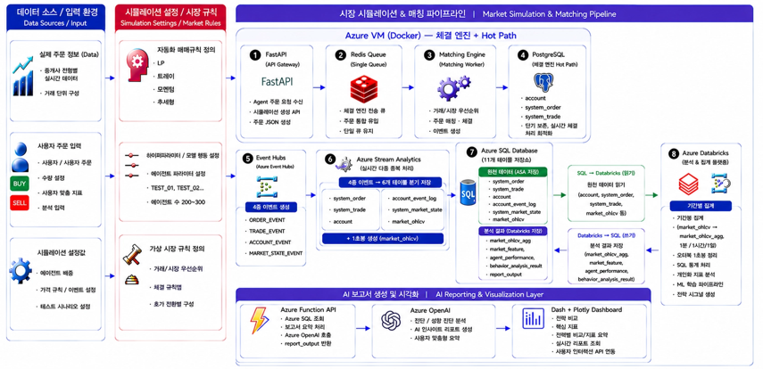

# STOCK CRAFT

### Azure 기반 실시간 디지털 트윈 주식 거래 샌드박스

> **사용자와 Rule-based Agent가 하나의 가상 시장에서 동시에 거래하고,
> 주문·체결·시장 변화를 실시간으로 수집하여 거래 행동과 시장 영향을 분석하는 Financial Sandbox Platform**

STOCK CRAFT는 일반적인 수익률 중심 모의투자 서비스가 아니라,
**여러 Agent가 상호작용하는 가상 주식시장을 직접 구성하고 사용자의 주문이 시장 가격과 체결 구조에 어떤 영향을 주는지 관찰하기 위한 실시간 거래 샌드박스**입니다.

실시간 주문·체결 이벤트를 Azure 기반 Streaming Pipeline으로 처리하고,
축적된 데이터를 Databricks에서 분석한 뒤 Azure OpenAI를 통해 사용자 거래 행동에 대한 분석 보고서를 생성합니다.

> ⚠️ 본 프로젝트는 교육 및 데이터 분석을 목적으로 구현된 **가상 주식시장 시뮬레이션**이며 실제 투자 서비스 또는 투자 추천 시스템이 아닙니다.

---

## 핵심 기능

* 사용자 주문과 Rule-based Agent 주문이 동시에 발생하는 **가상 주식시장 구현**
* 가격 우선 · 시간 우선 원칙을 적용한 **Order Book 기반 체결**
* 시장가 / 지정가 주문 및 **부분 체결(Partial Fill)** 지원
* 주문 · 체결 · 계좌 · 시장 상태 이벤트 실시간 수집
* 1초 단위 OHLCV 생성 및 실시간 시장 상태 추적
* Databricks 기반 시장 · Agent · 사용자 거래 행동 분석
* Azure OpenAI 기반 사용자 거래 패턴 분석 보고서 생성
* Dash + Plotly 기반 실시간 Dashboard 제공

---

## System Architecture

<p align="center">
  
</p>

STOCK CRAFT는 크게 세 영역으로 구성됩니다.

### 1. Market Simulation & Matching

```text
User / Agent Orders
        │
        ▼
     FastAPI
        │
        ▼
   Redis Queue
        │
        ▼
 Matching Engine
        │
        ▼
   PostgreSQL
```

Azure VM 내부의 Docker 환경에서 시장 시뮬레이션과 체결 엔진을 실행합니다.

* **FastAPI**
  사용자·Agent 주문 및 시뮬레이션 설정 API

* **Redis Queue**
  단일 주문 Queue 관리 및 주문 순서 유지

* **Matching Engine**
  가격 우선 · 시간 우선 기반 주문 매칭 및 체결 이벤트 생성

* **PostgreSQL**
  체결 엔진에서 필요한 단기 실시간 데이터를 처리하는 Hot Path 저장소

---

### 2. Real-time Data Pipeline

```text
Matching Engine
      │
      ▼
Azure Event Hubs
      │
      ▼
Azure Stream Analytics
      │
      ▼
Azure SQL Database
```

체결 엔진에서 생성되는 이벤트는 Event Hubs를 통해 Azure Streaming Pipeline으로 전달됩니다.

#### Event Types

```text
ORDER_EVENT
TRADE_EVENT
ACCOUNT_EVENT
MARKET_STATE_EVENT
```

Stream Analytics는 이벤트 유형에 따라 데이터를 분리하여 저장하고
시장 데이터를 기반으로 **1초 단위 OHLCV**를 생성합니다.

```text
Event Hubs
   │
   ▼
Stream Analytics
   ├── system_order
   ├── system_trade
   ├── account
   ├── account_event_log
   ├── system_market_state
   └── market_ohlcv
```

체결 처리와 분석 데이터 저장을 분리하여
실시간 이벤트가 증가하더라도 체결 엔진의 역할이 과도하게 커지지 않도록 구성했습니다.

---

### 3. Analytics & AI Reporting

```text
Azure SQL
    │
    ▼
Databricks
    │
    ├── Market Analysis
    ├── Agent Performance
    └── Behavior Analysis
    │
    ▼
Azure SQL
    │
    ▼
Azure Functions
    │
    ▼
Azure OpenAI
    │
    ▼
Dash / Plotly
```

Databricks는 Azure SQL에 적재된 원천 데이터를 읽어
시장 및 사용자 행동 분석에 필요한 정량 지표를 생성합니다.

#### Input

* 주문 로그
* 체결 로그
* 계좌 상태 및 변동 이력
* 시장 OHLCV

#### Processing

* OHLCV 집계
* 시장 지표 계산
* Agent / 사용자 성과 계산
* 거래 행동 분석 Context 생성
* AI 보고서 입력 JSON 생성

#### Output

```text
market_ohlcv_agg
market_feature
agent_performance
behavior_analysis_result
```

분석 결과는 다시 Azure SQL에 저장되며
Azure Functions가 필요한 데이터를 조회하여 Azure OpenAI에 전달합니다.

최종적으로 사용자의 최근 거래 패턴과 주요 지표를 기반으로
**투자 종목 추천이 아닌 거래 행동 분석 및 피드백 보고서**를 생성합니다.

---

# My Role

### Team Leader · Data Engineering · AI Reporting

프로젝트 전체 데이터 흐름과 저장 구조를 설계하고,
실시간 거래 데이터가 **수집 → 저장 → 분석 → AI 보고서 → Dashboard**까지 연결될 수 있도록 데이터 계층을 구성했습니다.

### Data Architecture

* 프로젝트 전체 데이터 흐름 및 단계별 전달 구조 설계
* 실시간 거래 데이터와 분석 데이터의 처리 목적에 따른 역할 분리
* Azure SQL Database Schema · Table · Column 구조 설계
* 주문 · 체결 · 계좌 · 시장 상태 · 분석 결과 데이터 간 관계 정의

### Data Engineering

* Event 기반 실시간 거래 데이터 처리 구조 설계
* Azure SQL ↔ Databricks 데이터 전달 구조 구성
* 분석 결과 저장을 위한 Table 구조 설계
* 시장 · 사용자 행동 분석 결과가 서비스에서 재사용될 수 있도록 데이터 구조화

### AI Reporting

* Azure Functions 기반 분석 보고서 API 구현
* Azure SQL에서 사용자 거래 및 분석 데이터 조회
* Databricks 분석 결과를 AI 입력 Context로 연결
* Azure OpenAI 기반 사용자 거래 행동 분석 보고서 생성 및 연동
* 생성 결과를 `report_output`에 저장하여 Dashboard에서 조회할 수 있도록 구성

### Project Leadership

* 팀장으로 프로젝트 기술 방향 및 전체 구조 조율
* 팀원별 데이터 입·출력 규격 및 연결 지점 조율
* 전체 산출물 관리 및 프로젝트 일정 조정
* 시스템 Architecture 및 발표 자료 통합

---

# Key Design Decisions

## 1. 체결 처리와 분석 저장의 분리

초기 구조에서는 Matching Engine이 데이터를 Database에 직접 저장하는 방식도 고려했습니다.

하지만 주문과 체결 이벤트가 증가할수록
체결 엔진이 **매칭 + 저장 + 이벤트 처리**까지 담당하게 되는 문제가 있었습니다.

따라서 다음과 같이 역할을 분리했습니다.

```text
Matching Engine
      │
      │  Event 생성
      ▼
 Event Hubs
      │
      │  수집 / 전달
      ▼
Stream Analytics
      │
      │  분류 / 가공
      ▼
  Azure SQL
```

이를 통해 체결 엔진은 **주문 매칭과 체결**에 집중하고,
Streaming Layer가 **이벤트 수집·분류·저장**을 담당하도록 구성했습니다.

---

## 2. Raw Data와 Analysis Data 분리

Azure SQL에서는 데이터를 목적에 따라 구분하여 관리했습니다.

### Raw / Operational Data

```text
account
account_event_log
system_order
system_trade
system_market_state
market_ohlcv
```

### Analytics Data

```text
market_ohlcv_agg
market_feature
agent_performance
behavior_analysis_result
```

### Report Data

```text
report_output
```

이 구조를 통해 실시간으로 발생하는 원천 데이터와
Databricks에서 생성되는 분석 결과, AI 보고서 결과의 역할을 분리했습니다.

---

## 3. Databricks ↔ Azure SQL 구조

Databricks는 Azure SQL의 원천 데이터를 읽어 분석을 수행하고
분석 결과만 다시 SQL에 저장하도록 구성했습니다.

```text
Azure SQL
   │
   │ READ
   ▼
Databricks
   │
   │ Analysis
   ▼
Aggregated / Feature Data
   │
   │ WRITE
   ▼
Azure SQL
```

이를 통해 SQL은 서비스와 분석 과정에서 함께 사용할 수 있는
중앙 데이터 저장소 역할을 수행하도록 설계했습니다.

---

# Database

주요 데이터는 다음 네 영역으로 관리합니다.

| Category | Table                      | Description               |
| -------- | -------------------------- | ------------------------- |
| 원천 데이터   | `account`                  | Agent별 최신 계좌 상태           |
|          | `account_event_log`        | 계좌 상태 변경 이력               |
|          | `system_order`             | 주문 원천 로그                  |
|          | `system_trade`             | 체결 원천 로그                  |
|          | `system_market_state`      | 시장 상태 Snapshot            |
| OHLCV    | `market_ohlcv`             | 1초 단위 OHLCV               |
|          | `market_ohlcv_agg`         | 1분 / 1시간 / 1일 집계 OHLCV    |
| 분석       | `market_feature`           | 시장 분석 지표                  |
|          | `behavior_analysis_result` | 사용자 행동 분석 및 AI 입력 Context |
|          | `agent_performance`        | Agent별 거래 성과              |
| 보고서      | `report_output`            | Azure OpenAI 분석 보고서 결과    |

---

# Repository Structure

```text
.
├── infra/
│   └── bicep/
│       ├── main.bicep
│       └── arm-template/
│
├── sql/
│   ├── create_table_scripts.sql
│   └── schema-docs/
│
├── functions/
│   └── report-function/
│
├── docs/
│   └── architecture.png
│
├── .gitignore
└── README.md
```

### `infra/`

Azure Resource를 코드로 관리하기 위한 Infrastructure as Code 파일

### `sql/`

Azure SQL Database의 Table · Column · Key · Index 정의

### `functions/`

Azure SQL 분석 데이터 조회 및 Azure OpenAI 보고서 생성을 담당하는 Azure Functions 코드

### `docs/`

전체 시스템 Architecture 및 프로젝트 문서

---

# Tech Stack

### Cloud

`Microsoft Azure`
`Azure Event Hubs` `Azure Stream Analytics`
`Azure SQL Database` `Azure Databricks`
`Azure Functions` `Azure OpenAI`

### Backend & Simulation

`Python` `FastAPI` `Redis` `PostgreSQL`

### Data

`SQL` `Pandas` `Databricks`

### Visualization

`Dash` `Plotly`

### Infrastructure

`Bicep` `ARM Template` `Docker`

---

# Project

**Microsoft Data School 4기 · 2차 프로젝트**

**기간**
2026.06 – 2026.07

**Role**
Team Leader · Data Engineering · AI Reporting
